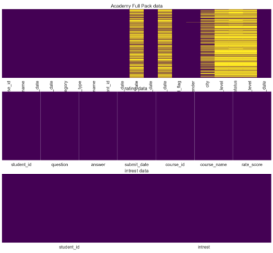
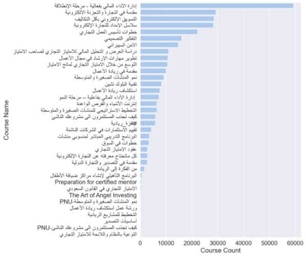
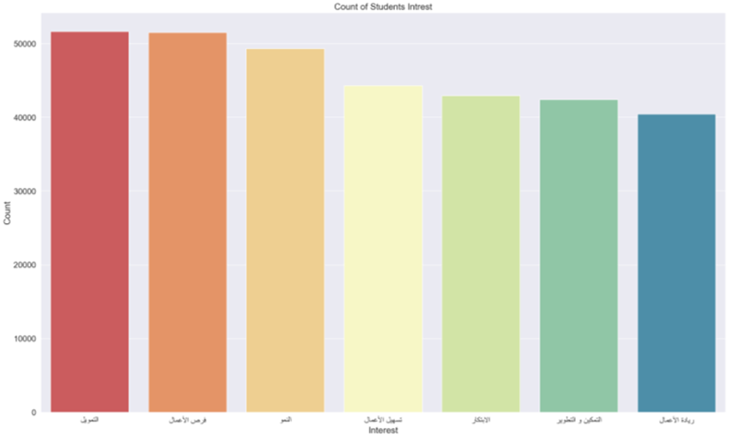
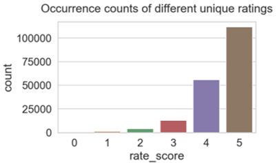
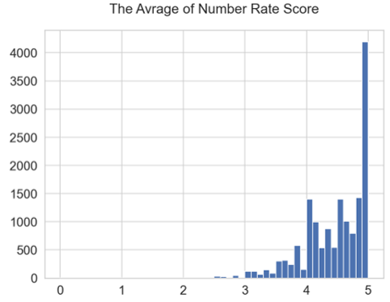
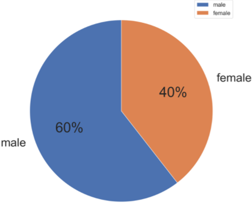

<head>
  <link
    rel="stylesheet"
    href="https://cdnjs.cloudflare.com/ajax/libs/animate.css/4.1.1/animate.min.css"
  />
</head>


#  Capstone: Monshaat Academy Recommender System 
by : Modhi Almannaa - Shahad Almangor - Rehab Alharbi (DataGeeks)


## Table of contents
* Introduction.
* Technologies.
* Get Started.
* Prerequisites.
* Installation.
* Approach.
* Conclusion.
* Acknowledgements.

## Introduction :

[academy.monshaat.gov.sa](https://academy.monshaat.gov.sa) is an online learning platform with more than 30 courses and over 9000 students. The platform offers courses in different categories e.g. Business, Entrepreneurship, Commercial concession or Technology and innovation . With all the available options it is very hard to choose the proper course, since everyone has a different taste. A recommender system helps students choose the next course, without spending hours reading different course descriptions. It does not only spare time for the user, but helps to find something interesting based on their intrest.

Our project is built up the following way: At first, we got the datasets from monshaat team. Then cleaning and EDA for the data. Secondly, We searched on the best model and build a recommender system.

## Technologies:

Project is created with:
* Python
* Flask 
* Bootstrap
* HTML, CSS
* LightFm algorithm

## Get Started

This is how to run the project by following the instructions for sitting up the project locally.
### Prerequisites
This is what you need to run the project:
* VS code.
* Local server such as, Xampp server.
### Installation
- Clone the project from repository.
  - Press clone, copy the link with HTTPS. 
  - Use git bash to clone, in bash type,
  ```bash
  $ git clone <link>
  ```
  - Or download the zip file.
- Run the local srever.
- Open VSCode.
- Open the project folder
  - Go to file.
  - Select open folder.
  - Choose the folder.
- Install all the libraries mentioned in  `requirements.txt` file.
  - Use the package manager [pip](https://pip.pypa.io/en/stable/) for installing.
   ```bash
  pip install <package_name>
  ```
- Run the project.
- Open terminal/command prompt from project directory and run the file `app.py` by executing the command `python app.py`
- Enter the localhost API in the browser.
## Approach


### Step 1: Organizing the Data 

Monshaat Academy has a Dataset, where all the course information, student Interests, and ratings can be achieved. we got the data it is contains 95.624 records courses through the Excel file and loaded them in a Dataframe. For all of these courses, we also load the Excel files user ratings and Interests.

### Step 2: Cleaning the data 

Followed these steps while cleaning the data:

* import the raw data
* transform the relevant columns
* filter the dataset
* keep the relevant columns
* drop duplicates
* treat the missing values
* save the cleaned data

The dataset was filtered so that it only contains courses with Ratings and Interests. After selecting the relevant and Non-missing values and combine them as Dataframe, the cleaned dataset consisted of  36 courses, which were analyzed during the exploratory data analysis (EDA) part. The non-relevant information, which cannot be used for modeling, was not selected from the origin database.

While cleaning the review data we realized there are many Duplicated student Interest data, which avoided duplicates through combining it using course id.

### Step 3: EDA

In this part we try to understand the Dataset by using Visualize.

To handling missing values, we use a Heat map to see which columns contain null values shown in visualize:



* the columns has missing values showen in heat map  are (course_type ,completed_date ,row_completed_date ,gender , city, education level ,job status, studnet_english_level)


The figure lists courses are divided into 36 courses. The most frequent course is ' إدارة الاداء المالي بفعالية - مرحلة الإنطلاقة'  as shown in the following bar plot:



The figure below shows Interest for each Student, two types of interest have high average are 'التمويل', 'فرص الأعمال', this means that students are interested in these two areas:



For the Number of Rate score data, the countplot were used.The following graphs show Occurrence counts of different unique ratings:

Summary of the most important findings:

*  The bar-plot shows the total number of rate score, 5 is the most dominant score, which means many students like the most of courses.




The Mean Rates scores per students ID are presented in the chart below:



* more than 4000 students are rating 5 that appear in the graph.

These two attributes were analyzed: “Male” and “Female”, to see which most gender of students joining Monshaat academy courses in this pie plot:



### Step 4: Modeling:
We tried to analyse both the objectives and the descriptions of the courses to find best recommendation model. Finally the recommendation algorithm based student interest better results.

we tried to use :
1. k-mean culstering 
2. User-based Collaborative Filtering using Nearest Neighbors
3. lightfm

(k- mean culstring )Was returnes duplicated value which made us search about another model. (User-based Collaborative Filtering using Nearest Neighbors) For some users it was returnes an empty value and also we has some issue when we tried to convert it to python script.(lightfm) Was returne the best value .

### Step 5: Building the Recommender System:
There are types of recommender systems: collaborative filtering, content based recommender system and hybrid recommender system.
* **Collaborative filtering:** uses the similarities in users’ behaviors and preferences to predict what users will like.
* **Content-based filtering:** use the description of the item and a profile of the user’s preferences to recommend new items.
* **Hybrid recommender:** combine both approaches.

After review the dataset, LightFm algorithm is an appropriate to build a recommender system model with hybrid collaborative and content based filtering. LightFM incorporates matrix factorization model, which decomposes the interaction matrix into two matrices (user and item), such that when you multiply them you retain the original interaction matrix.

Before building the recommender system:
1. Read the datasets, exploration and cleaning of datasets.
2. Merge the datasets and transformed the categorical features to dummies, that we can use these features as well in the recommender system.
3. Start build the recommender model by creating the functions, create a app.py using flask to run the model on a local environment.
4. Create a web pages for model and to get the prediction using HTML and CSS languages and bootsrap.


## Conclusion

At the end of this project, we have reached a result by using the best machine learning model (LightFM) to recommend courses. We have predicted the course recommendation for a student based on his\her interest and built a web application using Python script and flask and a web page was created using HTML, CSS and JavaScript to share it with Monshaat Academy.The future work will be dedicated to improved techniques and algorithms for the recommendation. In addition to that using more data and features including more information to help in course suggestions for the students.


## Acknowledgements

We would like to express our special thanks of gratitude to our Instructors:
- Mukesh Mithrakumar
- Husain Amer
- Rand Al Aaraj
- Amal Alzamel
- Amjad Alsulami

As well as Monshaat team :
 - Abdallah Alemran
 - Lama Alqasem
 - Mohammad Alsabi

Who gave us the golden opportunity to do this wonderful project on the topic course recommendetion system , which also helped us in doing a lot of Research and we came to know about so many new things we are really thankful to them.

Secondly, we would also like to thank our group for help each other a lot in finalizing this project within the limited time frame.

Best Regards,

Modhi Almannaa ,
Shahad Almangor and 
Rehab Alharbi 
